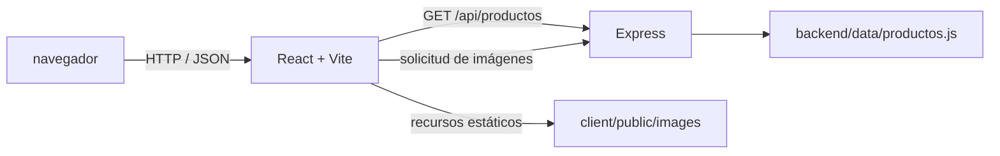

# Hermanos Jota

Catálogo web para una mueblería, construido con React y una API REST en Express. Permite explorar productos, consultar sus detalles y armar un carrito de compra en la interfaz.

## Descripción

Hermanos Jota es una aplicación web de presentación y exploración de muebles. Está pensada para personas que quieren conocer el catálogo, buscar productos por nombre y revisar sus características antes de contactar a la tienda.

El frontend obtiene el catálogo desde una API propia. Los datos actuales se mantienen en un módulo JavaScript del backend; no se utiliza una base de datos. El carrito permite calcular cantidades y el total, pero es temporal y no procesa pedidos ni pagos.

## Funcionalidades

- Inicio con productos destacados.
- Catálogo de productos con búsqueda por nombre, sin distinguir mayúsculas ni acentos.
- Vista de detalle con descripción, precio, imagen y especificaciones disponibles.
- Carrito con modificación de cantidades, eliminación de productos, vaciado y cálculo del total.
- Navegación entre inicio, catálogo y carrito; enlaces de contacto en el pie de página.
- API para consultar todos los productos, los destacados o un producto por identificador.
- Respuesta 404 para rutas no encontradas y para identificadores de producto inexistentes.

El carrito se guarda únicamente en el estado de la aplicación: se vacía al recargar la página. No hay checkout, gestión de pedidos, persistencia, autenticación ni administración de productos.

## Tecnologías utilizadas

### Frontend

- React 19
- Vite 8
- Tailwind CSS 4
- lucide-react para iconografía

### Backend

- Node.js
- Express 5
- CORS

### Datos

- Catálogo estático definido en `backend/data/productos.js`.
- No hay motor de base de datos configurado.

### Herramientas

- npm workspaces para organizar frontend y backend en un monorepo.
- concurrently para iniciar ambos servicios durante el desarrollo.
- ESLint para analizar el cliente.

## Arquitectura

El cliente React solicita los productos al servidor Express. El backend responde con los datos del módulo local y también publica las imágenes almacenadas en `backend/imagenes`. Las imágenes propias de la interfaz, como el logo y el hero, se sirven desde `client/public/images`.



### API disponible

Con el backend en `http://localhost:3000`:

- `GET /` devuelve un mensaje de estado de la API.
- `GET /api/productos` devuelve el catálogo completo.
- `GET /api/productos/destacados` devuelve hasta tres productos destacados.
- `GET /api/productos/:id` devuelve el producto cuyo identificador coincide; responde 404 si no existe.
- `/imagenes/*` sirve los archivos de imágenes del backend.

## Estructura del proyecto

```text
.
├── backend/
│   ├── config/                 
│   ├── controllers/           
│   ├── data/
│   │   └── productos.js        # Datos del catálogo
│   ├── imagenes/               # Imágenes servidas por Express
│   ├── middlewares/
│   │   └── logger.js           # Registro de solicitudes
│   ├── models/                 
│   ├── routes/
│   │   └── productoRoutes.js
│   ├── index.js                # Configuración e inicio de Express
│   ├── package.json
│   └── package-lock.json
├── client/
│   ├── public/
│   │   └── images/             # Recursos estáticos del sitio
│   ├── src/
│   │   ├── assets/             # Recursos importados por el cliente
│   │   ├── components/
│   │   │   ├── carrito/
│   │   │   │   └── CarritoView.jsx
│   │   │   ├── catalogo/
│   │   │   │   ├── CatalogoView.jsx
│   │   │   │   ├── CatalogProductCard.jsx
│   │   │   │   └── ProductDetail.jsx
│   │   │   ├── home/
│   │   │   │   ├── Hero.jsx
│   │   │   │   ├── HomeView.jsx
│   │   │   │   └── ProductosDestacados.jsx
│   │   │   ├── ProductCard.jsx
│   │   │   └── ProductList.jsx
│   │   ├── App.jsx             # Estado y navegación de la aplicación
│   │   ├── Footer.jsx
│   │   ├── index.css
│   │   ├── main.jsx
│   │   └── Navbar.jsx
│   ├── eslint.config.js
│   ├── index.html
│   ├── package.json
│   ├── package-lock.json
│   ├── README.md
│   └── vite.config.js
├── .github/
│   └── agents/
│       └── auditor-frontend-senior.agent.md
├── .gitignore
├── package.json                # Workspaces y comandos del monorepo
├── package-lock.json
└── README.md
```
## Requisitos

- Node.js 20.19 o superior, o 22.12 o superior (requisito de Vite 8).
- npm.

## Instalación y ejecución

Desde la raíz del repositorio, instalar las dependencias e iniciar el cliente y el backend:

```bash
npm install
npm run dev
```

Por defecto, Vite inicia el frontend en `http://localhost:5173` y Express escucha en `http://localhost:3000`.

Para iniciar cada servicio por separado:

```bash
npm run dev:client
npm run dev:backend
```

Para ejecutar el backend sin modo de desarrollo:

```bash
npm run start
```

### Configuración

- `PORT` (backend): puerto HTTP de Express. Su valor predeterminado es `3000`.
- `VITE_API_BASE_URL` (frontend): URL base de la API. Su valor predeterminado es `http://localhost:3000`. Si se define, puede guardarse en `client/.env.local`, por ejemplo:

```env
VITE_API_BASE_URL=http://localhost:3000
```

## Verificación

Ejecutar el análisis estático del cliente y generar el build de producción:

```bash
npm run lint --workspace client
npm run build
```
